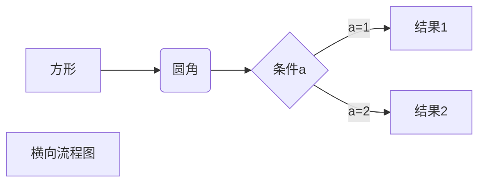

> **LaTeX公式入门**

# 0 目录

- 1 [简介](#index1)
- 2 [公式](#index2)
  - 2.1 [希腊字母](#index3)
  - 2.2 [上下标](#index4)
  - 2.3 [分式与根式](#index5)
  - 2.4 [普通运算符](#index6)
  - 2.5 [大型运算符](#index7)
  - 2.6 [标注符号](#index8)
  - 2.7 [箭头](#index9)
  - 2.8 [括号与定界符](#index10)
  - 2.9 [多行公式](#index11)
  - 2.10 [大括号](#index12)
  - 2.11 [矩阵](#index13)
  - 2.12 [实战演练](#index14)

# 1 简介

> 简介内容来自知乎 Aaron Zhu
> (公众号： ProjectDaedalus)  
> <https://zhuanlan.zhihu.com/p/110756681>

相信很多做学术的科研狗应该都是听过LaTeX排版写出来的Paper是多么的好看，颜值高。其实LaTeX简单来说就是一种文字处理软件/计算机标记语言。本文作为入门教程，不去过多解释其家族TeX、LaTeX、CTeX等等之间的伦理关系。一方面，用过Word的人都知道，排版的时间有的时候比写一篇文章的时间还长。更有甚者会遇到一些无解的玄学问题；另一方面，**对于很多顶级期刊、会议对于投稿论文格式明确要求是LaTeX，拒收Word格式**

LaTeX，作为广义上的**计算机标记语言**（比如HTML），它继承了计算机语言的光荣传统，通过一些简单的代码表达出精确的含义，具有不二义性。其文章排版的结果可以完全按照你的想法来，不仅解决了玄学问题，渲染出来的文章优美；同时，其还可以通过简单的语法写出优雅高贵的数学公式，**目前Markdown也已经支持LaTeX语法的公式**

## 1.1 示例

$$
\begin{Bmatrix}
   a & b \\
   c & d
\end{Bmatrix}
$$
$$
\begin{CD}
   A @>a>> B \\
@VbVV @AAcA \\
   C @= D
\end{CD}
$$

# 2 公式 

## 2.1 希腊字母 

$$
\delta,\lambda\\
\Delta,\Lambda\\
\Alpha\Beta\\
\phi,\varphi\\
\epsilon,\varepsilon\\
\pi\\
π
$$

## 2.2 上下标 

**格式：**

- 上标 `$a^3$` == $a^3$
- 下标 `$b_3$` == $b_3$
- 上标或下标有多个元素需要大括号括起。`$x^{y+z},p_{ij}$` == $x^{y+z},p_{ij}$

**注意：**

- **英文字母只有在表示变量(或单一字符的函数名称**，如$f(x)$时才可使用斜体，其余情况都应使用罗马体(直立体)。`\text{A C}`或`\rm{A B}`
  - **e :自然对数的底数，为常量**
  - **i,j:虚数单位，为常量**

    $$
    \text{e},\text{i}
    $$

- `\text{A B},\rm{A B}\\`中`\text`支持空格的显示，而`\rm`不支持空格显示

$$ 
\text{A B},\rm{A B}\\
$$

- `\text A B,\rm A B\\`不输入大括号`\text`只会对后面紧邻的第一个字符生效，而`\mathrm`会对所有字符生效

$$
\text A B,\rm A B\\
$$

- `{\rm A} B` 可以只将A罗马体而不影响B。

$$
{\rm A} B\\  
$$

## 2.3 分式与根式 

### 2.3.1 分式

**格式：**

-  `\frac{1}{2}` == $\frac{1}{2}$，前括号放分子，后括号放分母
   - 更简单的：`\frac 1 2` == $\frac 1 2$
   - 较复杂的：`\frac {\frac 1 x + 1}{y + 1}` == 

$$
\frac {\frac 1 x + 1}{y + 1}
$$

**注意：**

- 分子上$\frac 1 x$显示较小,可以将 `\frac` 改为 `\dfrac`   
  - (d,**d**isplay-style)
  - `\frac {\dfrac 1 x + 1}{y + 1}` ==

$$\frac {\dfrac 1 x + 1}{y + 1}$$

### 2.3.2 根式：

**格式：**

- `\sqrt [3]{x}` == $\sqrt [3]{x}$ ，(**sq**uare **r**oo**t**)
  - 中括号内放根次，大括号内放内容
  - 更简单的：`\sqrt 2,\sqrt{x+y}`

$$
\sqrt 2,\sqrt{x+y}
$$

## 2.4 普通运算符 

**格式：**

- 加、减、乘、除`$a+b$,$a-b$,$a \times b$, $a \div b$` (divide) ,点乘 `\cdot` (centre)

   - $a+b$,$a-b$,$a \times b$,$a \div b$,$a \cdot b$

- 正负号 `\pm` (plus-minus),负正号 `\mp` (minus-plus)
- 大于、小于、大于等于、小于等于、远大于、远小于、不等于、约等于(approximate)、恒等于(equivalent) `> < \ge \le \gg \ll \ne \approx \equiv`
- 交并集、属于、不属于、子集、真子集、空集 `\cap \cup \in \notin \subseteq \subsetneqq \varnothing`
- 任意、存在、不存在 `\forall \exists \nexists`
- 因为所以 `\because \therefore`
- 数集 `\mathbb{}` (blackboard bold) `\R,\mathbb{R},\mathbb{Q},\mathbb{N},\mathbb{Z_+}`
- 花体字母 `\mathcal{F}` (calligraphy,书法) `\mathscr{F}` (script,手迹)

$$
\pm,\mp\\
 \ge,\le,\gg,\ll,\ne,\approx,\equiv\\
\cap,\cup,\in,\notin,\subseteq,\subsetneqq,\varnothing\\
\forall,\exists,\nexists\\
\because,\therefore\\
\R,\mathbb{R},\mathbb{Q},\mathbb{N},\mathbb{Z_+}\\
\mathcal{F},\mathscr{F}
$$

- 省略号 `\cdots` ,纵向 `\vdots` (vertical) ,对角 `\ddots` (diagonal)

$$
\cdots,\vdots,\ddots
$$

- 无穷 `\infty` (infinity),偏微分符号 `\partial` ,拉普拉多算子 `\nabla` ,`\propto`
 (proportional to,正比于) ,度 `\degree`

$$
\infty,\partial,∂,\nabla,\propto,\degree
$$

- 三角函数`\sin x,\sec x` ,双曲函数`\cosh x`
- 对数 `\log_2 x, \ln x,\lg x`
- 极限 `\lim_{x \to 0} \frac{x}{sin x}`
  - 某些编辑器'x->0'显示在lim右下角，这时需要 `\lim\limits_{x \to 0} \frac{x}{sin x}`

$$
\sin x,\sec x,\cosh x\\
\log_2 x, \ln x,\lg x\\
\lim_{x \to 0} \frac{x}{sin x}\\
\max x
$$

**注意：**

- 运算符名称超过一个字母时应用直立体
  - 例如 MSE(x)(均方误差)

$$
\text{MSE}(x)
$$

## 2.5 大型运算符 

**格式：**

- 求和、求积 `\sum,\prod` (product)

$$
\sum,\prod\\
\sum_i,\sum_{i=0}^N\\
\frac{\sum\limits_{i=1}^n x_i}{\prod\limits_{i=1}^n x_i}
$$

- 积分 `\int,\iint,\iiint` (intergral,积分)
- 回路积分 `\oint,\oiint` 
- 

$$
\int,\iint,\iiint,\oint,\oiint\\
\int_{-\infty}^0 f(x)\,\text d x\\
$$

- 间距，从小到大 `a\,a a\ a a\quad a a\qquad a`

$$
a\, a\\
a\ a\\
a\quad a\\
a\qquad a
$$

## 2.6 标注符号 

**格式：**

- 向量的箭头符号 `\vec x` (vector), 大箭头`\overrightarrow{AB}`
- 平均值 `\bar x ` , `\overline{AB}` 大划线

$$
\vec x,\overrightarrow{AB}\\
\bar x,\overline{AB}
$$

## 2.7 箭头 

**格式：**

- 左箭头、右单箭头 `\leftarrow`
- 左双箭头、右双箭头 首字母大写 `Rightarrow,`
- 双向箭头双向单箭头同理 `\Leftrightarrow`
- 长箭头加 long `\longleftarrow`

$$
\leftarrow,\Rightarrow,\Leftrightarrow,\longleftarrow
$$

## 2.8 括号与定界符 

**格式：**

- 可以直接输入的直接输入、大括号需要转义`([])\{ \}\\`
- 左上取整、右上取整、左下取整、右下取整 `\lceil,\rceil,\lfloor,\rfloor`
- 定义域左右符号自适应大小 `\left(0,\frac 1 a\right]\\`
  - **引入虚拟括号** `\left.` 作自适应大小符号的另一端 `\left.\frac {∂f}{∂x}\right|_{x=0}`

$$
([])\{ \}\\
\lceil,\rceil,\lfloor,\rfloor,||\\
\left(0,\frac 1 a\right]\\
\left.\frac {∂f}{∂x}\right|_{x=0}
$$

## 2.9 多行公式 

- 换行 `\\` 可以，但并不规范，进行排版时可能会不支持
- `\begin{align} \end{align}` &(ampersand)用于标记对齐位置

$$
\begin{aligned}
   a&=b+c+d\\
   &=e+f
\end{aligned}
$$

$$
\begin{align}
a&=b+c+d\\
&=e+f
\end{align}
$$

## 2.10 大括号 

- `\begin{cases} \end{cases}` &(ampersand)用于标记对齐位置

$$
f(x)=
\begin{cases}
   \sin x, & -π\le x \le π\\
   0,& \text{其他}
\end{cases}
$$

## 2.11 矩阵 

- `\begin{matrix} \end{matrix}` &(ampersand)用于元素间的分隔
  - bmatrix 中括号、pmatrix 圆括号、vmatrix 行列式

$$
\begin{matrix}
a & b & \cdots & c \\
\vdots& \vdots & \ddots & \vdots \\
e & f& \cdots & g
\end{matrix}
$$

$$
\begin{bmatrix}
a & b & \cdots & c \\
\vdots& \vdots & \ddots & \vdots \\
e & f& \cdots & g
\end{bmatrix}
\begin{pmatrix}
a & b & \cdots & c \\
\vdots& \vdots & \ddots & \vdots \\
e & f& \cdots & g
\end{pmatrix}
\begin{vmatrix}
a & b & \cdots & c \\
\vdots& \vdots & \ddots & \vdots \\
e & f& \cdots & g
\end{vmatrix}
$$

**注意：**

- 矩阵字母应用加粗的罗马体来表示 `\bf A` (bold face,粗体)，且标准写法为 `\mathbf`
- `begin` 与 `end` 之间不要有空行

$$
\bf A,\bf B^{\rm T}
$$

## 2.12实战演练 

$$
f(x) = \frac 1 {\sqrt{2\pi} \sigma} {\rm e} ^ {-\frac {(x-\mu)^2}{2\sigma ^ 2}}\\
f(x) = \frac 1 {\sqrt{2\pi} \sigma} \exp \left[ {-\frac {(x-\mu)^2}{2\sigma ^ 2}}\right]
$$

$$
\lim\limits_{N\to \infty} P \left\{ \left| \frac {I\left( \alpha_i \right)}{N} - H(s) \right| < \varepsilon  \right\} = 1
$$

$$
x(n) = \frac 1 {2\pi} \int _{-π} ^ π X\left( {\rm e} ^ {{\rm j} \omega } \right) {\rm e} ^ {{\rm j} \omega n} \, {\rm d}\omega\\
$$

$$
\begin{align}
\vec B \left( \vec r \right) &= \frac {\mu_0}{4\pi}\oint_C \frac {I \, {\rm d} \vec l \times \vec R}{R^3}\\
&= \frac {\mu_0}{4\pi} \int_V \frac{\vec J_V \times \vec R}{R^3}\, {\rm d} V'
\end{align}
$$

