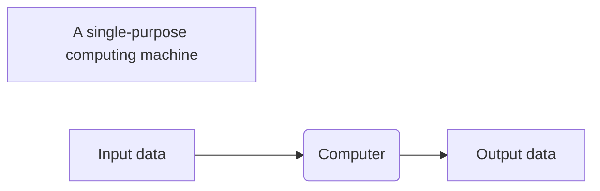
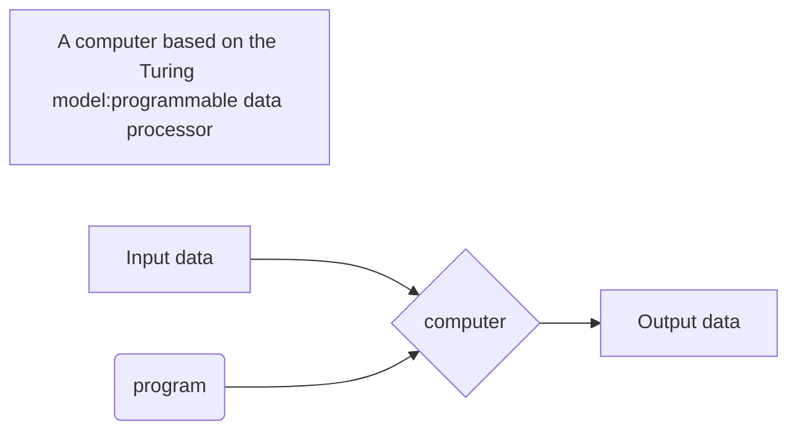
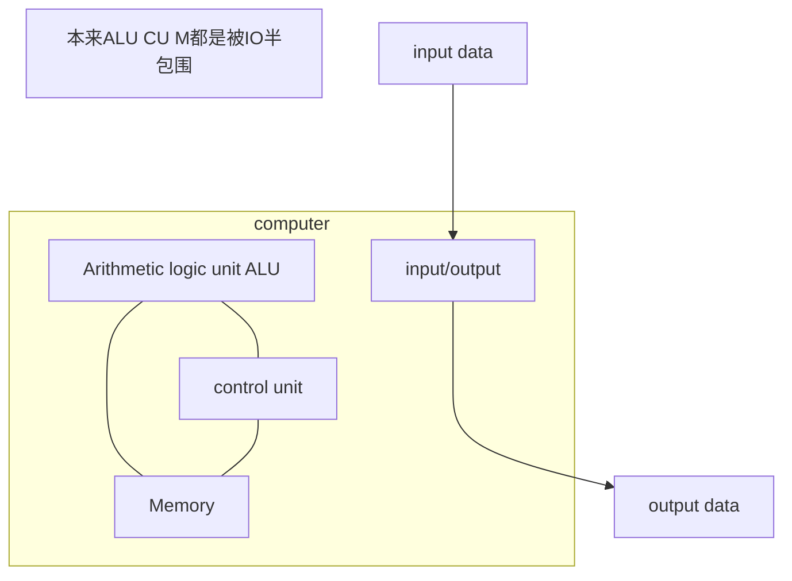

# 计算机科学导论
> 贝赫鲁兹·佛罗赞 ( Behrouz Forouzan )

# 0 目录

- 1 [Introduction](#introduction) 简介

# 1 Introduction 

> 本介绍性章节首先试图找出什么是计算机，然后研究与计算机直接相关的其他问题。我们首先将图灵模型视为计算的数学和哲学定义。然后，我们将展示今天的计算机是如何基于冯·诺依曼模型的。

- [ ] 定义计算机的图灵模型;
- [ ] 定义计算机的冯·诺依曼模型;
- [ ] 描述计算机的三大部分:硬件、数据和软件;
- [ ] 列举与计算机硬件相关的话题;
- [ ] 列举与数据相关的话题;
- [ ] 列举与软件相关的话题;
- [ ] 讨论与计算机使用相关的一些社会问题和职业道德问题;说出计算机的简明历史。
 
## 1.1 TURING MODEL 图灵模型

the idea of a universal computational device was first described by **Alan Turing in 1936**.
He proposed that all computation could be performed by a mathematical description of such a machine,now called a **Turing machine**.

### 1.1.1 Data processors 数据处理器 

problems:

- Too  general
- Does not specify the type of process

However today's computers are *general-purpose*(通用的) machines.This implies that we need to change this mobile into the Turing model to be able to reflect the actual computers of today.

### 1.1.2 Programmable data processors 可编程数据处理器

This model adds an extra element to the specific computing machine: *the program*.

A program
: is a set of instructions that tells the computer what to do with data.

In the Turing model,the **output data** depends on the combination of two factors:the input data and the program.

### 1.1.3 The universal Turing machine 通用图灵机

A machine that can do any computation if the appropriate program is provided,was the first description of a modern computer.

## 1.2 VON NEUMANN MODEL 冯·诺依曼模型

Computers built on the Turing machine store data in their memory.Around 1944 - 1945,John von Neumann proposed that,since program and data are logically the same,programs should also be stored in the memory of a computer.

### 1.2.1 Four subsystems 4个子系统

Computers built on the von Neumann model divide the computer hardware into four subsystems: memory,arithmetic logic unit,control unit,and input/output.
>依据冯诺依曼建造的模型机分为四个子系统：存储器、算术逻辑单元、控制单元和输入输出单元。

1. Memory
: The storage area.This is where programs and data are stored during processing.
2. Arithmetic logic unit
: ALU is where calculation and logical operations(逻辑运算) take place.
3. Control unit 
： CU controls the operations of the memory,ALU,and the input/output subsystem.
4. Input/output
: The input subsystem accepts input data and the program from outside the computer,
while the output subsystem sends the result of processing to the outside world.
> The definition of the input/output subsystem is very broad: it also includes secondary storage devices such as disk or tape that stores data and programs for processing.

### 1.2.2 The store program concept (存储程序概念)

The von Neumann model states that the program must be stored in memory.
> And this is different from the architecture of early computers in which only the data was stored in memory: the programs for their task were implemented by manipulating s set of switches or by changing the wiring system.

The memory of the modern computers hosts both a program and its corresponding data.

### 1.2.3 Sequential execution of instructions 指令的顺序执行

A program in the von Neumann model is made of a finite number(有限数)of **instructions**.
   
Sequential execution of a program(指令的顺序执行) was the initial requirement of a computer based on the von Neumann model. Today’s computers execute programs in the order that is the 
most efficient. 

## 1.3 COMPUTER COMPONENTS 计算机组成部分

We can think of a computer as being made up of three computers:computer hardware,data,and computer software.

### 1.3.1 computer hardware 

Computer hardware today has four components under the von Neumann model.

We discuss computer hardware in more detail in [Chapter 5]().

### 1.3.2 data 

The von Neumann model clearly defines a computer as a data processing machine that accepts the input data,processing it,and outputs the result.

**Storing data**

The von Neumann model does not define how data must be stored in a computer.If a computer is an electronic device,the best way to store data is in the form of an electronic signal,specifically its presents and absence.This implies that a computer can store data in one of two states.

In [Chapter 3](),we will learn how to store different types of data in binary pattern(二进制).
In [Chapter 4](),we show how data is manipulated,as a binary pattern.

**Organizing data**

Although data should be stored only in one side of a computer,a binary pattern,data outside of a computer can take many forms.

Today,data is not treated as a flat sequence of information.Instead,data is organized into small units,small units are organized into larger units,and so on.We will look at data from this point of view in [Chapter 11]() - [Chapter 14]().

### 1.3.3 Computer software 

The main feature of the Turing or von Neumann models is the concept of the program.

**Programs must be stored**

In the von Neumann model programs are stored in the computer's memory.Not only do we need memory  to hold data,but we need memory to hold the program.

**A sequence of instructions**

Another requirement of the model is that the program must consist of a sequence of instructions.
Each instruction operates on one or more data items(数据项).Thus,an instruction can change the effect of a precious instruction.

**Algorithms**

The requirement for a program to consist of a sequence of instructions made programming possible,bur it brought another dimension to using computer.A programer must not only learn the task performed by each instruction,but also learn how to combine these instructions to do a particular task.Looking at this issue differently,a programmer must first solve the problem in a step-by-step manner,then try to find the appropriate instruction (or series of instructions) to implement those steps.This step-by-step manner,then try to find the appropriate instruction (or series of instructions) to implement those steps.This step-by-ste solution is called an algorithm.Algorithms play a very important role in computer science and are discussed in [Chapter 8]().

**Language**

At the beginning of the computer age there was only one computer language,*machine language*.Programmers wrote instructions (using binary patterns) to solve a problem.However,as programs became larger,writing long program using these patterns became tedious.Computer came up with 
 the idea of using symbols to respect binary patterns,just as people use symbols (words) for commands in daily life.Of cause,the symbols used in daily life are different those used in computers.So the concepts of computer language was born.We will study computer language in [Chapter 9]().

 **Software engineering**

 Something that is not defined in the von Neumann model is software engineering,which is the design and writing of structured programs.In [Chapter 10]().

**Operating systems**

During the evolution of computers,scientists became aware that there was a series of instructions common to all programs.It is more efficient to write these instructions only once for the use of all programs.Thus the concept of the operating system emerged.An operating system emerged.In [Chapter 7]().

## 1.4 History 

In the section we briefly review the history of computers.We divide this history into three periods.

### 1.4.1 Mechanical machines (before 1930)

在这个阶段，人们发明了一些用来进行计算的机器，它们与计算机的现代概念几乎没有相似之处。

- 在17世纪，法国著名的数学家和物理学家布莱斯·帕斯卡（Blaise Pascal)发明了Pascsline，一个用来进行加减运算的计算机器。到了20世纪，当尼克劳斯·沃思(Niklaus Wirth)发明了一种结构化的程序设计语言，他将其命名为Pascal语言，用来纪念这位发明首台机械计算器的科学家。
- 在17世纪后期，德国数学家戈特弗里德·莱布尼茨(Gottfried Leibnitz)发明了既能够做乘除运算又能做加减运算的一台更加复杂的计算机器。这台机器被称为莱布尼茨之轮(Leibnitz's Whee1)。
- 第一台利用存储和编程概念的机器是雅卡尔提花织机(Jacquard loom),它是由约瑟夫-玛丽·雅卡尔(Joseph-Marie Jacquard)在19世纪初期发明的。这种织布机是利用穿孔卡（类似于存储程序）来控制在织布过程中经线的提升。
- 1823年，查尔斯·巴比奇(Charles Babbage）发明了一种差分引擎，它不仅能够很容易地进行数学运算，还可以解多项式方程。后来，他发明了一种叫做分析引擎的机器，在某种程度上和现代计算机的概念类似。该机器有4个组成部分，一个制造场(现在的算术逻辑单元)、一个存储单元(存储器)、一个操作者(控制单元)和输出单元(输入/输出)。
- 1890年，在美国人口普查办公室工作的赫尔曼·何勒里斯（Herman Hollerith)设计并制造出具有编程能力的机器，该机器可以自动阅读、计数和排列存储在穿孔卡上的数据

### 1.4.2 The birth of electronic computers(1930-1950)

Between 1930 and 1950,several computers were invented by scientists who could be considered the pioneers of the electronic computer industry.

**Early electronic computers**

这一时期的早期计算机并不是将程序存储到存储器中，所有的计算机都是在外部进行编程的。有以下5种比较杰出的计算机

- 第一台用来完成特定任务的计算机是通过将信息进行电子编码来实现其功能的，它是由约翰·阿塔纳索夫(John V.Atanasoff）及其助手克利福德·贝里(CliffordBerry)于1939年发明的。它又被称为ABC ( Atanasoff Berry Computer)，主要用于实现解线性方程的系统。
- 在同一时期，名为康拉德·朱斯(Konrad Zuse)的德国数学家设计出通用计算机，并命名为“Z1”。
- 在20世纪30年代，美国海军和IBM公司在哈佛大学发起创建了一项工程，在霍华德·艾肯(Howard Aiken)的直接领导下发明建造了一台名为Mark Ⅰ的巨型计算机。这种计算机既使用了电子部件，也使用了机械部件。
- 在英国，阿兰·图灵发明了一台名为巨人(Colossus)的计算机，这台计算机是为破译德国Enigma密码而设计的。
第一台通用的、完全电子的计算机由约翰·莫奇勒(John Mauchly)和普雷斯波·埃克特(J.Presper Eckert）发明，这台计算机被称为.ENIAC (Electronic NumericalIntegrator and Calculator，电子数字集成器和计算器)。它是在1946年完成设计的，利用了将近18 000个集成块，有100英尺长，10米英尺高，重达30吨。

**Computers based on the von Neumann model**

前面5种计算机的存储单元仅仅用来存放数据。它们利用配线或开关进行外部编程。冯·诺依曼提出了程序和数据应该存储在存储器中。按照这种方法，每次使用计算机来完成一项新的任务。你只需要改变程序，而不用重新布线或者调节成百上千的开关。

第一台基于冯氏思想的计算机于1950年在宾夕法尼亚大学诞生，命名为
EDVAC。与此同时，英国剑桥大学的莫里斯·威尔克斯(Maurice Wilkes)制造了同样类型的被称为EDSAC的计算机。

### 1.4.3 Computer generations(1950-present)

computers built after 1950 more or less follow the von Neumann model.They have become faster,smaller,and cheaper,but the principle is almost the same.Historians divide this period into generations,with each generation witnessing some major change in hardware or software(but not in the model).

**First generation**

第一代计算机(大约1950～1959年)以商用计算机的出现为主要特征。在这个时期,计算机只有专家们才能使用。它们被锁在房子里，限制操作者和计算机专家以外的人员进人。计算机体积庞大，且使用真空管作为电子开关。此时的计算机只有大的机构才能负担得起。

**Second generation**

第二代计算机(大约1959～1965年)使用晶体管代替真空管。这既减小了计算机的体积，也节省了开支，从而便得中小型企业也可以负担得起。FORTRAN和COBOL参见[第9章]()两种高级计算机程序设计语言的发明使得编程更加容易。这两种语言将编程任务和计算机运算任务分离开来。一个土木工程师能够直接编写一个FORTRAN程序来解决问题，而不必涉及计算机结构中的具体电子细节。

**Third　generation** 

集成电路（晶体管、导线以及其他部件做在一块单芯片上)的发明更加减少了计算机的成本和大小。小型计算机出现在市场上。封装的程序，就是通常所说的软件包也已经有售。小型公司可以买到需要的软件包(如会计程序)，而不必写自己的程序。一个新的工业——软件工业就此诞生了。这个时期大概从1965年持续到1975年。

**Forth generation**

第四代计算机(大约1975～1985年)出现了微型计算机。第一个桌面计算器（Altair8800）出现在1975年。电子工业的发展允许整个计算机子系统做在单块电路板上。这一时代还出现了计算机网络参见[第6章]()。

**Fifth generation**

这个还未终止的时代始于1985年。这个时代见证了掌上计算机和台式计算机的诞生、第二代存储媒体(CD-ROM、DVD等)的改进、多媒体的应用以及虚拟现实现象。

## 1.5  COMPUTER SCIENCE AS A DISCIPLINE

With the invention of computers,a new discipline has evolved:computer science.Like any other discipline,computer science has now divided into several areas.

We can divided these areas into broad categories
: systems areas and applications areas.

Systems areas cover those areas that directly related to the creation of the software and hardware,such as computer architecture,computer networking,security issues,operating systems,algorithms,programming languages,and software engineering.Applications areas cover those that are related to the use of computers,such as database and artificial intelligence.This book is a breadth-first approach to all of those areas.After reading the book,the reader should have enough information to select the desired area of specialty.

## 1.6 OUTLINE OF THE COURSE

After this introductory chapter, the book is divided into five parts.

### 1.6.1 Part I: Data representation and operation

This part includes Chapters 2, 3, and 4. Chapter 2 discusses number systems, how a 
quantity can be represented using symbols. Chapter 3 discusses how different data is 
stored inside the computer. Chapter 4 discusses some primitive operations on bits.

### 1.6.2 Part II: Computer hardware

This part includes Chapters 5 and 6. Chapter 5 gives a general idea of computer hardware, 
discussing different computer organizations. Chapter 6 shows how individual computers 
are connected to make computer networks, and internetworks (internets). In particular, 
this chapter explores some subjects related to the Internet and its applications.

### 1.6.3 Part III: Computer software

This part includes Chapters 7, 8, 9, and 10. Chapter 7 discusses operating systems, the 
system software that controls access to the hardware by users—either human or application 
programs. Chapter 8 shows how problem solving is reduced to writing an algorithm for 
the problem. Chapter 9 takes a journey through the list of contemporary programming 
languages. Finally, Chapter 10 is a review of software engineering, the engineering approach 
to the development of software.

### 1.6.4 Part IV: Data organization and abstraction

This part complements Part I. In computer science, atomic data is collected into records, 
files, and databases. Data abstraction allows the programmer to create abstract notions 
about data. Part IV includes Chapters 11, 12, 13, and 14. Chapter 11 discusses data 
structure, collecting data of the same or different type under one category. Chapter 12 
discusses abstract data types. Chapter 13 shows how different file structures can be used 
for different purposes. Finally, Chapter 14 discusses databases.

### 1.6.5 Part V: Advanced topics

Part V gives an overview of advanced topics, topics that students of computer science will 
encounter later in their education. This part covers Chapters 15, 16, 17, and 18. Chapter 15 
discusses data compression, which is prevalent in today’s data communications. Chapter 16 
explores some issues to do with security, which is becoming more and more important 
when we communicate over insecure channels. Chapter 17 discusses the theory of computation: what can and cannot be computed. Finally Chapter 18 gives some idea of artificial 
intelligence, a topic wih day-to-day challenges in computer science.

### 1.6.6 Part VI: Social media and social Issues

Part VI briefly discusses social media and social issues, two topics that students of computer science may be interested to explore.

## 1.7 END-CHAPTER MATERIALS

### 1.7.1   Recommended reading

For more details about the subjects discussed in this chapter, the following books are 
recommended:
- Schneider, G. M. and Gersting, J. L. Invitation to Computer Science, Boston, MA: Course 
Technology, 2004
- Dale, N. and Lewis, J. Computer Science Illuminated, Sudbury, MA: Jones and Bartlett, 2004
- Patt, Y. and Patel, S. Introduction to Computing Systems, New York: McGraw-Hill, 2004

### 1.7.3 Summary

- The idea of a universal computational device was first put forward by Alan Turing in 1936.He proposed that all computations can be performed by a special kind of a machine,now called a Turing machine.
- The von Neumann model defines a computer as four subsystems:memory,arithmetic logic unit,control unit,and input/output.The von Neumann model states that the program must be stored in memory.
- We can think of computing and computers can be divided into three periods:the period of mechanical machines (before 1930),the period of electronic computers (1930-1950),and the period that includes the five modern computer generations.
- With the invention of computers a new disciple has evolved,computer science,which is now divided into several areas.